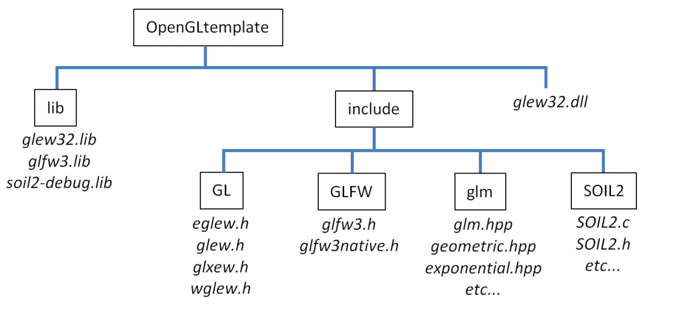
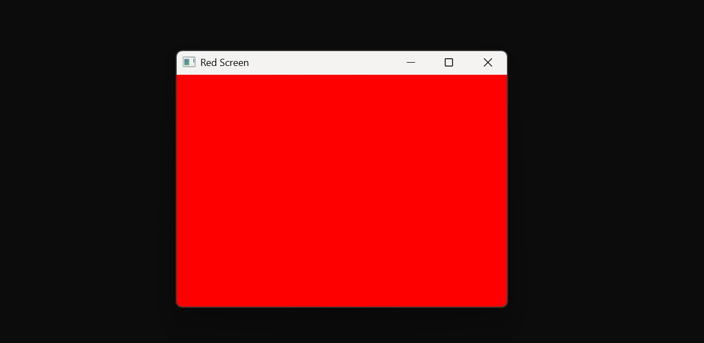
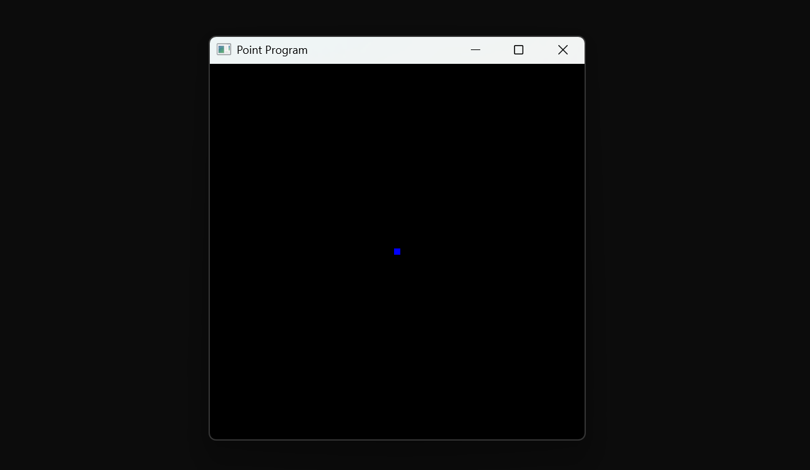
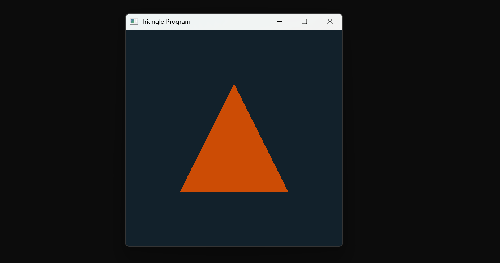
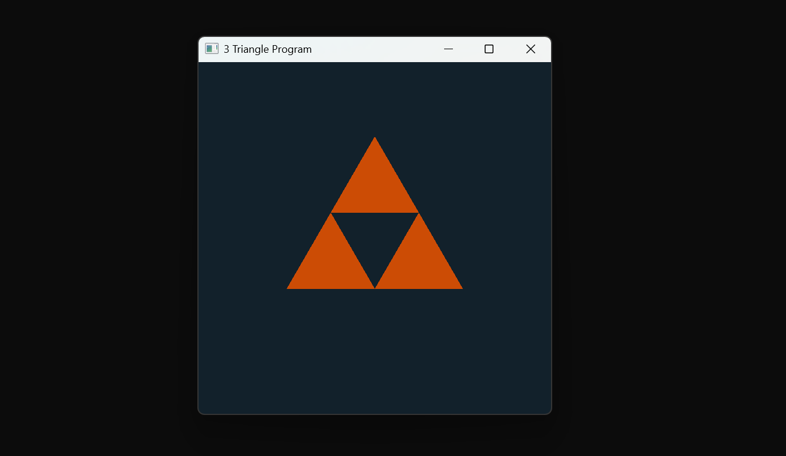

# OpenGL - Graphics Programming

In this repo I dive into OpenGL Graphics Programming

### References Used
- COMPUTER GRAPHICS PROGRAMMING IN OPENGL WITH C++ by V SCOTT GORDAN AND JOHN CLEVENGER

### What is OpenGL?
- It is a cross-platfrom, cross language Graphics Programming API used for 2D and 3D rendering. It used GLSL Shader Language.

### Prerequesites
For Microsoft Window

1. GLFW - Graphics Library Framework - To create a Window
   Download the Source from www.glfw.org and build it using CMAKE.
2. GLEW - OpenGL Extension Wrangler - To access modern OpenGL functions
    Download from glew.sourceforge.net
3. GLM - OpenGL Mathematics - To perform mathmatic calculations 
    Download from https://github.com/g-truc/glm
4. SOIL2 - Simple OpenGL Image Loader - To load textures
    Download from (https://github.com/SpartanJ/SOIL2) and use premake5 to build it (To VS2022 (Because if Use Visual Studio 2022 Community Edition))
5. A OpenGL Supported GPU.
6. Visual Studio 2022 with C++ Development Environment
- After the above steps, collect the above library files as follows

### Creating a OpenGL Template in VS2022
Open a new empty console C++ project and do the following for both Debug and release configurations
1. Go to Project properties -> VC++ -> General : In the include directories, add include folder from above that we created
2. In Linker -> General -> Additional Library Directories: In this add the lib folder from the above that we created.
3. In Linker -> Input-> Additional Library Directories: In this add the following: glfw3.lib, glew32.lib, soil2-debug.lib, opengl32.lib

After all the above, go to Project and Export temple -> give the template a name and use this template as the base project for all the OpenGL projects.

### Programs
1. basic-GLFW-window-color - A basic program that opens a GLFW Window and Colors that Window Red.

2. point - A basic program with a vertex shader and a fragment shader to draw a Vertex on the Window

3. triangle - A basic program with a vertex shader and a fragment shader to draw a triangle using three vertices.

3. triangle3 - A basic program with a vertex shader and a fragment shader to draw a 3 triangle using index buffers to not repeat vertices.

